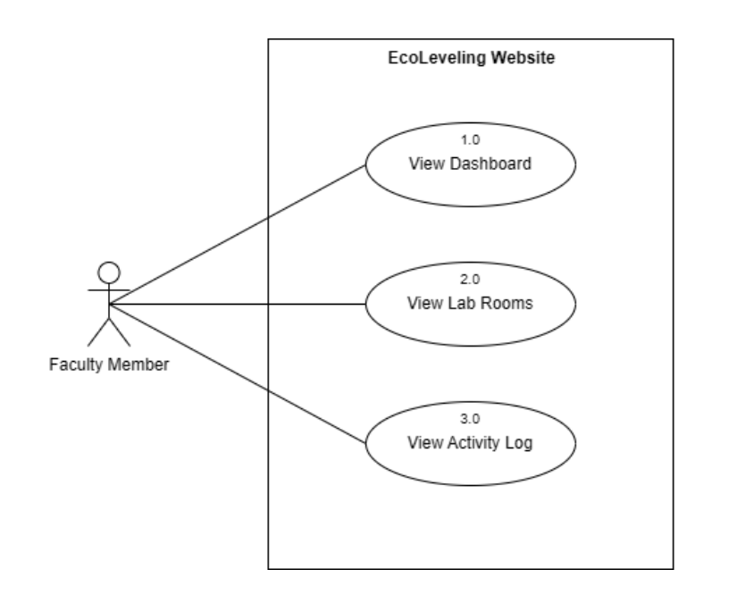

[English](/README.md) | [Tagalog](/README-FIL.md)

# EcoLeveling (Website Documentation)

## Overview

<p align="center">
  
</p>
The diagram shown the use cases for the ECOLEVELING website, highlighting the interactions a faculty member can have with the system. One key function allows the user to view the dashboard, which provides a comprehensive analysis of data collected from the ECOLEVELING IoT system, showcasing various metrics and insights for monitoring overall performance. Users can access and manage lab rooms, where they have the ability to control the lighting by turning lights on and off, as well as view individual electricity consumption data, which can be filtered by date to offer detailed insights into energy usage patterns. Additionally, the user can navigate and filter through the activity log, reviewing recorded activities to help in monitoring and auditing the system's usage and actions.

## Table of Contents

- [EcoLeveling (Website Documentation)](#ecoleveling-website-documentation)
  - [Overview](#overview)
  - [Table of Contents](#table-of-contents)
  - [Installation](#installation)
    - [Prerequisites](#prerequisites)
    - [Backend Setup (Laravel)](#backend-setup-laravel)
    - [Frontend Setup (Vue.js)](#frontend-setup-vuejs)
  - [Usage](#usage)
    - [Starting the Development Server](#starting-the-development-server)
    - [Building for Production](#building-for-production)
  - [Screenshot](#screenshot)
    - [Dashboard](#dashboard)
    - [Specific Room Monitoring Page](#specific-room-monitoring-page)
    - [Website Activity Log Page](#website-activity-log-page)

## Installation

### Prerequisites

Before you begin, ensure you have the following installed on your machine:

-   PHP >= 7.4
-   Composer
-   Node.js >= 12.x
-   npm or Yarn
-   MySQL or any other preferred database

### Backend Setup (Laravel)

1. **Be in the Folder**

    ```sh
    cd ecoleveling
    ```

2. **Install PHP dependencies:**

    ```sh
    composer install
    ```

3. **Create a `.env` file:**

    ```sh
    cp .env.example .env
    ```

4. **Generate an application key:**

    ```sh
    php artisan key:generate
    ```

5. **Configure the `.env` file:**

    - Set your database credentials.
    - Set other environment variables as needed.

6. **Run the migrations:**
    ```sh
    php artisan migrate
    ```

### Frontend Setup (Vue.js)

1. **Go to the frontend directory:**

    ```sh
    cd ecoleveling
    ```

    so, you are now in `ecoleveling\ecoleveling`

2. **Install JavaScript dependencies:**
    ```sh
    npm install
    # or
    yarn install
    ```

## Usage

### Starting the Development Server

To start the Laravel development server and the Vue.js development server:

1. **Start the Laravel server:**

    Go back to [Backend](/) and run

    ```sh
    php artisan serve
    ```

2. **Start the Vue.js development server:**
    ```sh
    npm run dev
    # or
    yarn dev
    ```

### Building for Production

To run the assets for frontend production:

1. **Locate frontend directory [\ecoleveling](\ecoleveling)**

2. **Build Vue.js assets:**
    ```sh
    npm run production
    # or
    yarn production
    ```

## Screenshot

### Dashboard


-   On the dashboard, you can see how data adds up over different dates. You will also find detailed logs of recent activities and information about the monitored rooms.

### Specific Room Monitoring Page


-   You can see the specific room's data changes over time. You can filter and analyzer data for specific dates, whether you want to see it monthly or daily. **There is a button to easily control room's light.** You can turn it on or off whenever you need, whether it is automatically or manually.

### Website Activity Log Page


-   Activity log page makes it easy for users to filter and navigate through activities, facilitated by a user-friendly interface with pagination features.
